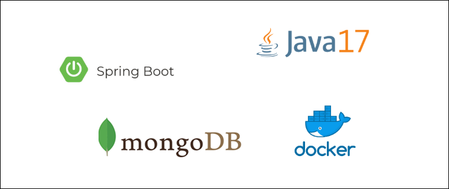

# MicroServiço - Gestão de Pacientes

Micro serviço responsável pela gestão de pacientes

- Controle de Pacientes

Url de acesso: http://localhost:8094/api/v1

## Stack

- Java 17
- Spring Boot
- Docker
- Mongodb



## Iniciar testes unitários

Execução dos testes unitários. Necessário ter o utilitário make instalado.

```shell
make api/test
```

## Iniciar ambiente dev/local

Inicia container e configura a aplicação. Necessário ter o utilitário make instalado. 

```shell
make dev/local
```

ou inicialização manual

```shell
docker-compose up -d
mvnw spring-boot:run
```

## GIT
https://github.com/adriano-pinheiro/fase5-mspatient


## Collection para importação no Postman
[patient.postman_collection.json](externalfiles%2Fpatient.postman_collection.json)


## Documentação API

- [Criar um Paciente](docs/create.md)
- [Pesquisar Lista de pacientes](docs/list.md)
- [Pesquisar paciente pelo ID ](docs/serchById.md)
- [Pesquisar paciente pelo CPF](docs/serchByCpf.md)
- [Pesquisar paciente pelo RNE](docs/serchByRne.md)
- [Deletar um paciente pelo ID](docs/delete.md)
- [Atualizar um paciente pelo ID](docs/update.md)

## Swagger
http://localhost:8094/swagger-ui/index.html